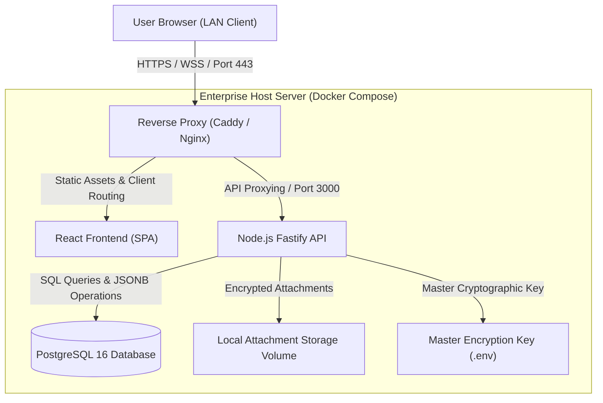

# 🏛️ Document 01: System Architecture & Technology Stack

---

## 1. System Architecture Overview

**Daftar** is deployed as an on-premise, self-contained web platform within the organization's local area network (LAN) or private cloud. The architecture is built on a clean **Client-Server Decoupled Architecture** paired with a reverse proxy to handle secure HTTPS and WebSocket traffic.



---

## 2. Technology Stack Rationale

### 2.1. Frontend
- **Framework & Build System:** `React 18+` with `Vite` and `TypeScript`.
  * **Rationale:** Blazing fast hot module replacement (HMR), minimal bundle footprint across local networks, battle-tested ecosystem stability, and complete end-to-end type safety.
- **Styling & Design System:** `Tailwind CSS v3+` with `tailwindcss-rtl`.
  * **Rationale:** Rapid UI prototyping with native Right-To-Left (RTL) support alongside LTR monospace technical tokens, dark/light theme switching, and sleek visual aesthetics inspired by modern productivity tools like Linear and Notion.
- **Typography:** **Vazirmatn** for clean Persian typography, paired with **JetBrains Mono** for technical data (IP addresses, ports, hashes, credentials).
- **Advanced Data Grid:** `@tanstack/react-table v8`.
  * **Rationale:** Headless, highly performant, with robust out-of-the-box support for dynamic columns, column pinning, sorting, filtering, and row virtualization for large asset inventories.
- **Date & Calendar Widgets:** `jalali-moment` and custom Jalali/Gregorian datepickers for renewal and expiration tracking.
- **Markdown Engine:** `react-markdown` + `remark-gfm` + `rehype-highlight` for rendering sanitized technical procedures, configuration scripts, and operational runbooks.

### 2.2. Backend
- **Runtime & Framework:** `Node.js 20 LTS` with `Fastify` and `TypeScript`.
  * **Fastify vs. Express:** Up to 2x higher throughput, native JSON Schema validation via Ajv, clean plugin-based lifecycle encapsulation, and low-overhead streaming for file downloads and uploads.
- **Database Access Layer (ORM):** `Prisma ORM`.
  * **Rationale:** Strict type generation, safe migrations, and seamless support for PostgreSQL `JSONB` native operators.
- **Cryptography:** Native `node:crypto` standard utilizing industry-grade `AES-256-GCM` with authenticated encryption tags.

### 2.3. Database
- **Primary Database:** `PostgreSQL 16`.
  * **Rationale:** Enterprise durability, ACID compliance, and first-class unstructured data storage via `JSONB` paired with Generalized Inverted Indexes (`GIN`). This enables real-time search across dynamic, custom asset schemas without the resource overhead of dedicated search engines like Elasticsearch.

### 2.4. Reverse Proxy & Network Security
- **Reverse Proxy:** `Caddy v2`.
  * **Rationale:** Automatic internal self-signed TLS generation and renewal (`tls internal`), zero-friction configuration (`Caddyfile`), and low memory footprint.
  * **HTTPS Requirement:** Modern web browsers (Chrome, Firefox, Safari) restrict the Clipboard API (`navigator.clipboard.writeText`) exclusively to **Secure Contexts** (HTTPS or localhost). Deploying behind Caddy ensures 1-click credential copying works smoothly across LAN IP addresses.

---

## 3. Repository Directory Structure

The repository is organized as a lightweight, clean monorepo:

```plaintext
daftar/
├── .github/                      # CI/CD workflows and actions
├── docs/                         # Technical architecture and design specifications
│   ├── 01-architecture-and-stack.md
│   ├── 02-data-model-and-schema.md
│   ├── 03-security-and-encryption.md
│   ├── 04-ui-ux-and-components.md
│   ├── 05-core-features-spec.md
│   └── 06-deployment-and-operations.md
├── docker/                       # Container configuration files
│   ├── Caddyfile                 # Reverse proxy & internal TLS configuration
│   ├── Dockerfile.client         # Frontend production build container
│   ├── Dockerfile.server         # Fastify API server container
│   └── backup.sh                 # Automated periodic database backup worker
├── docker-compose.yml            # Single-command full-stack container orchestration
├── .env.example                  # Environment configuration template
├── README.md                     # Project overview and quick start guide
│
├── client/                       # Frontend application (React + Vite SPA)
│   ├── public/                   # Fonts, icons, and static assets
│   ├── src/
│   │   ├── assets/               # Brand assets and SVG illustrations
│   │   ├── components/           # Reusable UI component library
│   │   │   ├── common/           # Form inputs, tooltips, modals, buttons
│   │   │   ├── grid/             # Excel-like data grid and dynamic column renderers
│   │   │   ├── docs/             # Markdown viewers and runbook editors
│   │   │   ├── reminders/        # Expiration badges and renewal widgets
│   │   │   └── audit/            # Audit log timelines and diff viewers
│   │   ├── hooks/                # Custom React hooks (useClipboard, useAuth, etc.)
│   │   ├── layouts/              # Main layout shell and category navigation sidebar
│   │   ├── pages/                # Route views (Dashboard, Assets, Settings, Audit)
│   │   ├── services/             # API client, HTTP interceptors, and endpoints
│   │   ├── store/                # Client state management (Zustand)
│   │   ├── types/                # Shared TypeScript type definitions
│   │   └── utils/                # Date formatting, clipboard helpers, sanitizers
│   ├── index.html
│   ├── package.json
│   ├── tailwind.config.js
│   └── vite.config.ts
│
└── server/                       # Backend application (Node.js + Fastify)
    ├── prisma/
    │   ├── schema.prisma         # Database schema definitions
    │   └── migrations/           # Versioned database migrations
    ├── src/
    │   ├── config/               # Environment variables and cryptographic secrets
    │   ├── controllers/          # API route request handlers
    │   ├── middlewares/          # Authentication, validation, and rate-limiting
    │   ├── plugins/              # Fastify plugins (CORS, Multipart, Rate-limit, Helmet)
    │   ├── routes/               # REST API endpoints definition
    │   ├── services/             # Domain logic and business services
    │   │   ├── crypto.service.ts # Symmetric encryption and decryption helpers
    │   │   ├── audit.service.ts  # Audit trail and diff logging engine
    │   │   ├── reminder.service.ts # Expiration schedule monitoring & alerts
    │   │   ├── notification.service.ts # Multi-channel webhook/bot alert dispatcher
    │   │   ├── excel.service.ts  # Excel/CSV import and export pipelines
    │   │   └── storage.service.ts# Attachment storage and download streaming
    │   ├── types/                # DTO and request/response type definitions
    │   └── app.ts                # Fastify server entry point and bootstrap
    ├── package.json
    └── tsconfig.json
```

---

## 4. Request Lifecycle & Data Flow

### 4.1. Creating a New Asset with Encrypted Secrets
1. The user inputs asset details (e.g., Hostname, IP address, root username, SSH password) into the dynamic asset form.
2. The frontend submits a `POST /api/assets` request with the payload.
3. Backend processing:
   * The payload is validated against the category's `schemaDefinition`.
   * Fields defined as `secret` or `password` are separated from standard fields.
   * `crypto.service.ts` uses the 32-byte `MASTER_ENCRYPTION_KEY` and a cryptographically random 12-byte initialization vector (IV) to encrypt each secret using `AES-256-GCM`.
   * The asset record is committed to PostgreSQL: standard values are stored in `values (JSONB)`, and encrypted objects (containing IV, Auth Tag, and Ciphertext) are stored in `encrypted_values (JSONB)`.
   * An immutable audit log entry is inserted into `AuditLog` (`ACTION_CREATE_ASSET`).

### 4.2. Viewing or Copying a Secret by an Authorized User
1. In the asset grid, sensitive fields are masked by default (`••••••••`).
2. An authorized user clicks the **Reveal** (👁️) or **Copy** (📋) button.
3. A security request `POST /api/assets/:id/reveal-secret` is dispatched specifying the target secret field.
4. The server validates the user's session, role, and category-level permissions.
5. Upon authorization:
   * The secret is decrypted in memory.
   * An audit entry is recorded: *"User X copied/revealed secret field Z for Asset W"*, including the timestamp and client IP address.
   * The decrypted plaintext is returned to the client and written directly to the system clipboard or unmasked temporarily with a 30-second security auto-hide countdown.

---

## 5. Resilience & Operational Guidelines

1. **Air-Gapped & Offline Compatibility:** Daftar is 100% self-contained. No external CDN or internet connection is required at runtime; all web fonts, icons, and client bundles are compiled locally.
2. **Automated Daily Backups:** An isolated Docker container runs an automated daily cron job producing compressed `.sql.gz` PostgreSQL dumps with a rolling 30-day retention window.
3. **Defense in Depth & Rate Limiting:** Global rate limiting (100 req/min for general routes, 10 req/min for authentication endpoints), OWASP security headers via `@fastify/helmet`, and a 50MB file size ceiling for attachments protect against abuse and resource exhaustion.
