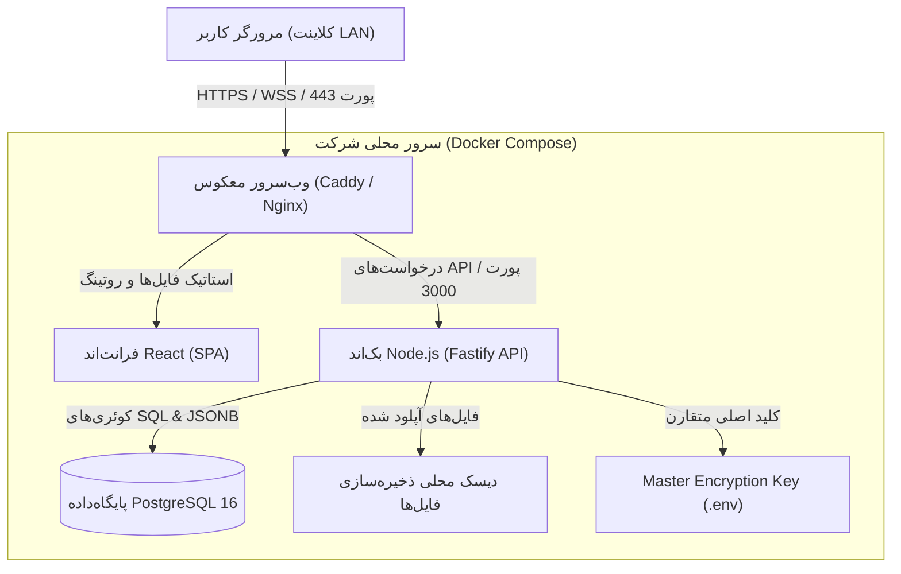

# 🏛️ سند ۰۱: معماری کلان و استک فنی (Architecture & Tech Stack)

---

## ۱. نمای کلی معماری سیستم (System Overview)

سامانه «دفتر» به صورت یک نرم‌افزار تحت وب مستقل (Self-contained Web Application) در بستر شبکه محلی (LAN) سازمان مستقر می‌شود. معماری نرم‌افزار بر پایه تفکیک کامل کلاینت و سرور (Client-Server Decoupled Architecture) همراه با یک پروکسی معکوس (Reverse Proxy) برای مدیریت ترافیک امن HTTPS طراحی شده است.



---

## ۲. توجیه فنی انتخاب استک (Technology Stack Rationale)

### ۲.۱. فرانت‌اند (Frontend)
- **فریم‌ورک و ابزار بیلد:** `React 18+` با `Vite` و `TypeScript`.
  * **دلیل انتخاب:** سرعت بیلد فوق‌العاده بالا، بهینگی حجم فایل‌ها در شبکه محلی، پایداری طولانی‌مدت اکوسیستم و تایپ‌سیفتی کامل.
- **استایل‌دهی و طراحی:** `Tailwind CSS v3+` به همراه پلاگین `tailwindcss-rtl`.
  * **دلیل انتخاب:** توسعه سریع رابط کاربری فارسی و راست‌چین با پشتیبانی از تم‌های تیره/روشن (Dark/Light Mode) و امکان ایجاد کامپوننت‌های مدرن شبیه به ابزارهای نسل جدید نظیر Linear و Notion.
- **فونت و تایپوگرافی:** فونت استاندارد و زیبای **«وزیرمتن» (Vazirmatn)** به همراه اعداد فارسی برای نمایش استاندارد داده‌ها و ارقام مالی/آی‌پی.
- **مدیریت جداول پویا:** `@tanstack/react-table v8`.
  * **دلیل انتخاب:** سبک، فوق‌العاده قدرتمند، بدون وابستگی تحمیلی به UI، با قابلیت‌های داخلی بی‌نظیر برای مدیریت ستون‌های متغیر، پین کردن ستون‌ها، فیلتر و سورت مجازی (Virtualization) برای رکوردهای حجیم.
- **گاه‌شمار و ویجت تاریخ:** `jalali-moment` و دیت‌پیکر اختصاصی شمسی برای مدیریت سررسیدها.
- **رندرینگ مارک‌داون:** `react-markdown` + `remark-gfm` + `rehype-highlight` جهت رندر ایمن و غنی کدهای کانفیگ و اسکریپت‌ها.

### ۲.۲. بک‌اند (Backend)
- **محیط اجرا و فریم‌ورک:** `Node.js 20 LTS` با `Fastify` و `TypeScript`.
  * **دلیل انتخاب Fastify نسبت به Express:** سرعت تا ۲ برابر بیشتر، پشتیبانی توکار از اعتبارسنجی اسکیما با JSON Schema (Ajv)، معماری پلاگین‌محور بسیار تمیز و مدیریت استریم کارآمد در دانلود/آپلود فایل‌های حجیم.
- **لایه دسترسی به پایگاه‌داده (ORM/Query Builder):** `Prisma ORM`.
  * **دلیل انتخاب:** تولید تایپ‌های خودکار برای مدل‌ها، مهاجرت‌های امن (Migrations)، پشتیبانی عالی از عملیات‌های بومی ستون‌های `JSONB` در PostgreSQL.
- **رمزنگاری:** ماژول نیتیو `node:crypto` با استاندارد صنعتی `AES-256-GCM`.

### ۲.۳. پایگاه داده (Database)
- **پایگاه داده اصلی:** `PostgreSQL 16`.
  * **دلیل انتخاب:** پایداری بی‌رقیب، پشتیبانی استثنایی از داده‌های ساختارنیافته از طریق `JSONB` و ایندکس‌های قدرتمند `GIN` (Generalized Inverted Index) که امکان جستجوی پرسرعت در میان فیلدهای متغیر داینامیک را فراهم می‌سازد، بدون نیاز به نصب موتورهای سنگینی مثل Elasticsearch.

### ۲.۴. پروکسی معکوس و امنیت شبکه محلی
- **وب‌سرور:** `Caddy v2`.
  * **دلیل انتخاب:** تولید خودکار و مدیریت گواهی‌های TLS/SSL خودامضا داخلی (Internal Self-Signed)، کانفیگ بسیار ساده در حد چند خط (Caddyfile)، بدون نیاز به دانش پیچیده Nginx یا Cron job تمدید سرتیفیکیت.
  * **ضرورت HTTPS:** مرورگرهای وب مدرن (کروم و فایرفاکس) قابلیت کپی به کلیپ‌بورد (`navigator.clipboard.writeText`) را در اتصالات غیرامن HTTP بر روی آدرس‌های آی‌پی LAN مسدود می‌کنند. فعال بودن HTTPS پیش‌نیاز حیاتی ویژگی «کپی با یک کلیک» است.

---

## ۳. ساختار پوشه‌بندی پروژه (Repository Directory Structure)

پروژه با ساختار ماژولار Monorepo سبک (با استفاده از `pnpm workspaces` یا تفکیک تمیز در یک مخزن) سامان‌دهی می‌شود:

```plaintext
daftar/
├── .github/                      # اسکریپت‌های CI/CD احتمالی
├── docs/                         # مستندات جامع فنی معماری
│   ├── 01-architecture-and-stack.md
│   ├── 02-data-model-and-schema.md
│   ├── 03-security-and-encryption.md
│   ├── 04-ui-ux-and-components.md
│   ├── 05-core-features-spec.md
│   └── 06-deployment-and-operations.md
├── docker/                       # فایل‌های کانفیگ استقرار کانتینری
│   ├── Caddyfile                 # تنظیمات وب‌سرور و SSL خودامضا
│   ├── Dockerfile.client         # بیلد فرانت‌اند
│   ├── Dockerfile.server         # بیلد بک‌اند Fastify
│   └── backup.sh                 # اسکریپت بکاپ‌گیری دوره‌ای دیتابیس
├── docker-compose.yml            # استقرار تک‌دستوری کل سرویس‌ها
├── .env.example                  # نمونه متغیرهای محیطی سیستم
├── README.md                     # راهنمای اصلی مخزن
│
├── client/                       # برنامه سمت کاربر (React + Vite SPA)
│   ├── public/                   # فونت‌ها و فایل‌های استاتیک
│   ├── src/
│   │   ├── assets/               # آیکون‌ها و لوگوی دفتر
│   │   ├── components/           # کامپوننت‌های عمومی (دکمه، مدال، لایه‌بندی)
│   │   │   ├── common/           # فرم‌ها، تولتیپ‌ها، ورودی‌ها
│   │   │   ├── grid/             # جدول داده اکسل‌گونه و ستون‌های داینامیک
│   │   │   ├── docs/             # کامپوننت‌های رندر و ادیتور Markdown
│   │   │   ├── reminders/        # ابزارک‌ها و لیست هشدارهای سررسید
│   │   │   └── audit/            # نمایشگر لاگ و Diff تغییرات
│   │   ├── hooks/                # هوک‌های سفارشی (useClipboard, useAuth, ...)
│   │   ├── layouts/              # چیدمان اصلی و سایدبار دسته‌بندی‌ها
│   │   ├── pages/                # صفحات (داشبورد، دارایی‌ها، تنظیمات، ...)
│   │   ├── services/             # فراخوانی توابع API و اینترسپتورها
│   │   ├── store/                # مدیریت استیت کلاینت (Zustand)
│   │   ├── types/                # تعاریف تایپ‌های مشترک
│   │   └── utils/                # توابع کمکی (فرمت تاریخ شمسی، کپی، ...)
│   ├── index.html
│   ├── package.json
│   ├── tailwind.config.js
│   └── vite.config.ts
│
└── server/                       # برنامه سمت سرور (Node.js + Fastify)
    ├── prisma/
    │   ├── schema.prisma         # تعریف مدل‌های دیتابیس
    │   └── migrations/           # تاریخچه مهاجرت‌های پایگاه داده
    ├── src/
    │   ├── config/               # خواندن متغیرهای محیطی و کلید مستر
    │   ├── controllers/          # کنترلرهای مسیرهای API
    │   ├── middlewares/          # احراز هویت، اعتبارسنجی، لاگ‌گیری
    │   ├── plugins/              # پلاگین‌های Fastify (CORS, Multipart, ...)
    │   ├── routes/               # تعریف Endpointهای REST
    │   ├── services/             # لایه منطق بیزینس و محاسبات
    │   │   ├── crypto.service.ts # توابع رمزنگاری و رمزگشایی متقارن
    │   │   ├── audit.service.ts  # موتور ثبت لاگ و تفاوت مقادیر
    │   │   ├── reminder.service.ts # زمان‌بندی و پایش سررسیدها
    │   │   ├── excel.service.ts  # پردازش فایل‌های ورود و خروج داده
    │   │   └── storage.service.ts# مدیریت آپلود و دانلود فایل‌ها
    │   ├── types/                # تایپ‌های ورودی و خروجی DTO
    │   └── app.ts                # نقطه ورود و راه‌اندازی سرور
    ├── package.json
    └── tsconfig.json
```

---

## ۴. چرخه حیات درخواست‌ها و جریان داده (Data Flow Lifecycle)

### ۴.۱. ثبت یک دارایی جدید با فیلد پسورد
1. کاربر در فرم داینامیک، مشخصات سرور (IP، نام، کاربر، پسورد) را وارد می‌کند.
2. فرانت‌اند درخواست `POST /api/assets` را ارسال می‌نماید.
3. در بک‌اند:
   * مقادیر اعتبارسنجی می‌شوند (فیلدهای اجباری بررسی می‌گردند).
   * فیلدهای با نوع `password` یا `secret` از بقیه مقادیر جدا می‌شوند.
   * ماژول `crypto.service.ts` با کلید ۳۲ بایتی `MASTER_ENCRYPTION_KEY` و یک بردار اولیه (IV) تصادفی ۱۲ بایتی، مقدار را با الگوریتم `aes-256-gcm` رمزنگاری می‌کند.
   * رکورد در PostgreSQL ذخیره می‌شود: فیلدهای عادی در ستون `values (JSONB)` و فیلدهای قفل‌شده در ستون `encrypted_values (JSONB)`.
   * یک ردیف در جدول `audit_logs` با عنوان `ACTION_CREATE_ASSET` درج می‌گردد.

### ۴.۲. مشاهده یا کپی رمز عبور توسط کاربر مجاز
1. در جدول، فیلد پسورد به شکل ماسک‌شده `••••••••` نمایش داده می‌شود.
2. کاربر مجاز روی آیکون «نمایش» یا «کپی» کلیک می‌کند.
3. یک درخواست امنیتی `POST /api/assets/:id/reveal-secret` شامل فیلد درخواستی ارسال می‌شود.
4. سرور سطح دسترسی کاربر و نقش او را بررسی می‌کند.
5. در صورت تایید دسترسی:
   * فیلد در حافظه سرور رمزگشایی (Decrypt) می‌شود.
   * هم‌زمان در جدول `audit_logs` ثبت می‌شود: *"کاربر X در زمان Y رمز فیلد Z از دارایی W را کپی/مشاهده کرد"*.
   * مقدار رمزگشایی‌شده به کلاینت بازگردانده شده و مستقیماً روی کلیپ‌بورد کپی می‌شود.

---

## ۵. استراتژی مدیریت خطا و تاب‌آوری (Resilience & Error Handling)

1. **خطای عدم دسترسی به شبکه خارجی (Offline-First):** سرور کاملاً به صورت مستقل (Self-contained) در شبکه داخلی بدون نیاز به اینترنت برای رندر فونت‌ها یا کتابخانه‌ها کار می‌کند (فونت وزیرمتن و تمامی فایل‌ها به صورت باندل لوکال بسته‌بندی می‌شوند).
2. **پشتیبان‌گیری خودکار (Daily Automated Backups):** کانتینر اختصاصی داکر به صورت کرون‌جاب شبانه از دیتابیس Postgres با فرمت فشرده `.dump` خروجی می‌گیرد و در دیسک ذخیره می‌کند.
3. **محدودیت حجم و زمان (Rate Limiting & File Size Limit):** فیلتر کردن درخواست‌ها برای جلوگیری از اشباع سرور در شبکه محلی و تعیین سقف ۵۰ مگابایت برای فایل‌های پیوست.
