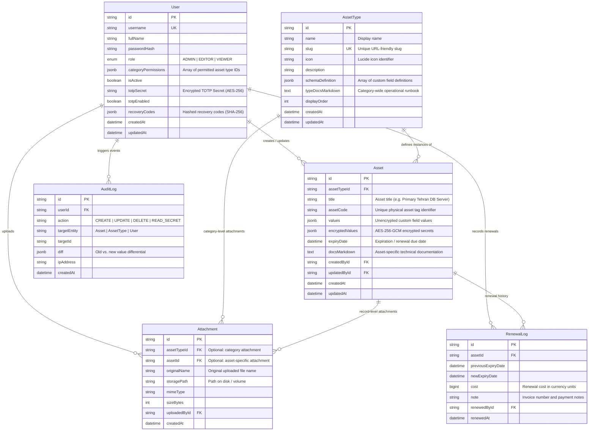

# 🗄️ Document 02: Data Model & Database Schema

---

## 1. Entity Relationship (ER) Diagram

Daftar is backed by PostgreSQL, employing a hybrid data architecture combining structured relational tables with flexible schemaless `JSONB` columns for user-defined attributes.



---

## 2. Dynamic Field Definition (`schemaDefinition`)

A core capability of Daftar is allowing administrators to define custom field structures for any asset type without running database migrations. These definitions are stored in the `schemaDefinition` column of `AssetType` as a JSON array.

### 2.1. TypeScript Interface for Dynamic Fields
```typescript
export type FieldType = 
  | 'text'          // Single-line text (hostname, domain name, username)
  | 'email'         // Email address with mailto action
  | 'textarea'      // Multi-line descriptions and notes
  | 'secret'        // Encrypted credentials, API tokens, private keys
  | 'ip_port'       // IP address with optional port (e.g. 192.168.1.10:22)
  | 'url'           // Web URL with direct navigation link
  | 'jalali_date'   // Solar/Gregorian date with expiration alerting
  | 'select';       // Single-select dropdown from predefined options

export interface FieldDefinition {
  id: string;              // Unique schema identifier (e.g. "f_ip_addr")
  name: string;            // Key stored in JSONB columns (e.g. "server_ip")
  label: string;           // Display label (e.g. "IP Address")
  type: FieldType;         // Data type
  isRequired: boolean;     // Mandatory validation flag
  placeholder?: string;    // Input placeholder text
  options?: string[];      // Predefined options for select type
  isSecret?: boolean;      // Stored in encryptedValues vs. values
  showInTable: boolean;    // Default visibility in the Excel grid view
  order: number;           // Display order in forms and grid
}
```

### 2.2. Production Example: "Virtual Private Server (VPS)" Schema
```json
[
  {
    "id": "f_1",
    "name": "ip_address",
    "label": "IP Address",
    "type": "ip_port",
    "isRequired": true,
    "showInTable": true,
    "order": 1
  },
  {
    "id": "f_2",
    "name": "ssh_port",
    "label": "SSH Port",
    "type": "text",
    "isRequired": false,
    "showInTable": true,
    "order": 2
  },
  {
    "id": "f_3",
    "name": "root_user",
    "label": "Username",
    "type": "text",
    "isRequired": true,
    "showInTable": true,
    "order": 3
  },
  {
    "id": "f_4",
    "name": "root_password",
    "label": "Root Password",
    "type": "secret",
    "isRequired": true,
    "isSecret": true,
    "showInTable": true,
    "order": 4
  },
  {
    "id": "f_5",
    "name": "os_type",
    "label": "Operating System",
    "type": "select",
    "options": ["Ubuntu 22.04", "Ubuntu 24.04", "Debian 12", "Windows Server 2022", "Rocky Linux 9"],
    "isRequired": false,
    "showInTable": true,
    "order": 5
  },
  {
    "id": "f_6",
    "name": "expiry_date",
    "label": "Renewal Expiry Date",
    "type": "jalali_date",
    "isRequired": false,
    "showInTable": true,
    "order": 6
  }
]
```

---

## 3. Storage Separation: Cleartext vs. Encrypted Values

To ensure strict zero-leakage security while maintaining high-speed indexing:
- **`values (JSONB)` column:** Stores all unencrypted, searchable attributes.
- **`encryptedValues (JSONB)` column:** Stores sensitive secrets encrypted with AES-256-GCM. Each field is serialized as an envelope containing its initialization vector, authentication tag, and ciphertext:

```json
{
  "root_password": {
    "iv": "a1b2c3d4e5f6...",
    "authTag": "9f8e7d6c5b4a...",
    "ciphertext": "8374928374abcdef..."
  }
}
```

---

## 4. Database Indexing Strategy

To guarantee sub-50ms query response times even across large asset inventories:

```sql
-- Foreign keys and high-frequency filter indexes
CREATE INDEX idx_assets_type_id ON "Asset"("assetTypeId");
CREATE INDEX idx_assets_expiry ON "Asset"("expiryDate") WHERE "expiryDate" IS NOT NULL;
CREATE INDEX idx_assets_code ON "Asset"("assetCode");
CREATE INDEX idx_audit_created_at ON "AuditLog"("createdAt" DESC);
CREATE INDEX idx_audit_user_id ON "AuditLog"("userId");

-- Generalized Inverted Index (GIN) on values JSONB for instant custom attribute searches
CREATE INDEX idx_assets_values_gin ON "Asset" USING gin ("values" jsonb_path_ops);

-- Trigram indexing on asset title for fuzzy search
CREATE INDEX idx_assets_title_trgm ON "Asset" USING gin ("title" gin_trgm_ops);
```

---

## 5. Schema Evolution Rules

When an administrator updates an asset type's schema:
1. **Adding a New Field:** The field is appended to `schemaDefinition`. Existing records default to `null` for this attribute without throwing database errors.
2. **Deleting a Field:** The field is removed from `schemaDefinition`. Historical values stored in database rows are preserved (soft deprecation at the UI layer) to prevent irreversible data loss.
3. **Changing Field Types:** A validation warning is displayed. Existing stored values are either safely cast or rendered as raw text.
