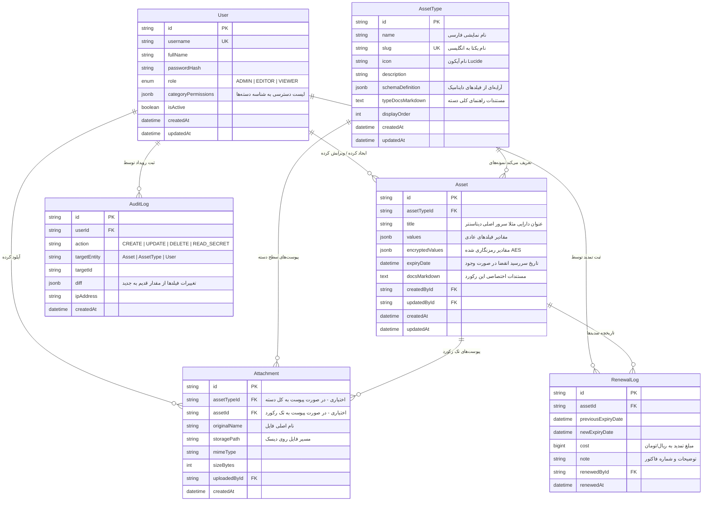

# 🗄️ سند ۰۲: مدل داده و ساختار پایگاه‌داده (Data Model & Schema)

---

## ۱. دیاگرام روابط موجودیت‌ها (ER Diagram)

پایگاه داده سامانه «دفتر» در PostgreSQL پیاده‌سازی شده و ترکیبی هوشمندانه از جداول رابطه‌ای ساخت‌یافته و ستون‌های بدون‌طرح (Schemaless JSONB) است.



---

## ۲. طراحی فیلدهای داینامیک (`schemaDefinition`)

یکی از کلیدی‌ترین بخش‌های سامانه دفتر، تعریف ساختار فیلدها به صورت داینامیک برای هر نوع دارایی است. این فیلدها در ستون `schemaDefinition` جدول `AssetType` به شکل یک آرایه JSON ذخیره می‌شوند:

### ۲.۱. تایپ تایپ‌اسکریپت ساختار فیلد:
```typescript
export type FieldType = 
  | 'text'          // متن کوتاه تک‌خطی (نام دامنه، نام کاربری و...)
  | 'email'         // آدرس ایمیل با آیکون و لینک mailto
  | 'textarea'      // توضیحات چندخطی
  | 'secret'        // پسورد، کلید خصوصی، توکن امنیتی (رمزنگاری شده و ماسک‌شده)
  | 'ip_port'       // آدرس آی‌پی به همراه پورت اختیاری (مثلاً 192.168.1.10:22)
  | 'url'           // لینک وب با آیکون هدایت مستقیم
  | 'jalali_date'   // تاریخ شمسی (با امکان فعال‌سازی هشدار تمدید)
  | 'select';       // لیست انتخابی کشویی با گزینه‌های از پیش تعریف شده

export interface FieldDefinition {
  id: string;              // شناسه یکتای فیلد در اسکیما (مثلاً "f_ip_addr")
  name: string;            // کلید ذخیره‌سازی در دیتابیس (مثلاً "server_ip")
  label: string;           // برچسب فارسی نمایش (مثلاً "آدرس آی‌پی")
  type: FieldType;         // نوع فیلد
  isRequired: boolean;     // آیا وارد کردن آن اجباری است؟
  placeholder?: string;    // راهنمای داخل فیلد
  options?: string[];      // گزینه‌ها برای نوع select
  isSecret?: boolean;      // آیا در ستون رمزنگاری‌شده نگهداری شود؟
  showInTable: boolean;    // آیا به صورت پیش‌فرض در جدول اکسل‌گونه ستون باشد؟
  order: number;           // ترتیب نمایش در فرم و جدول
}
```

### ۲.۲. نمونه واقعی `schemaDefinition` برای نوع دارایی «سرور مجازی (VPS)»:
```json
[
  {
    "id": "f_1",
    "name": "ip_address",
    "label": "آدرس IP",
    "type": "ip_port",
    "isRequired": true,
    "showInTable": true,
    "order": 1
  },
  {
    "id": "f_2",
    "name": "ssh_port",
    "label": "پورت SSH",
    "type": "text",
    "isRequired": false,
    "showInTable": true,
    "order": 2
  },
  {
    "id": "f_3",
    "name": "root_user",
    "label": "نام کاربری",
    "type": "text",
    "isRequired": true,
    "showInTable": true,
    "order": 3
  },
  {
    "id": "f_4",
    "name": "root_password",
    "label": "رمز عبور Root",
    "type": "secret",
    "isRequired": true,
    "isSecret": true,
    "showInTable": true,
    "order": 4
  },
  {
    "id": "f_5",
    "name": "os_type",
    "label": "سیستم عامل",
    "type": "select",
    "options": ["Ubuntu 22.04", "Ubuntu 24.04", "Debian 12", "Windows Server 2022", "Rocky Linux"],
    "isRequired": false,
    "showInTable": true,
    "order": 5
  },
  {
    "id": "f_6",
    "name": "expiry_date",
    "label": "تاریخ سررسید تمدید",
    "type": "jalali_date",
    "isRequired": false,
    "showInTable": true,
    "order": 6
  }
]
```

---

## ۳. تفکیک مقادیر آشکار و پنهان در جدول `Asset`

برای تضمین حداکثر امنیت و در عین حال حفظ سرعت جستجو:
- **ستون `values (JSONB)`:** تمامی فیلدهای متنی غیرمحرمانه ذخیره می‌شوند.
- **ستون `encryptedValues (JSONB)`:** فیلدهای امنیتی (مانند پسوردها و توکن‌ها) پس از رمزنگاری با فرمت زیر ذخیره می‌شوند:

```json
{
  "root_password": {
    "iv": "a1b2c3d4e5f6...",
    "authTag": "9f8e7d6c5b4a...",
    "ciphertext": "8374928374abcdef..."
  }
}
```

---

## ۴. استراتژی ایندکس‌گذاری و کارایی (Database Indexing Strategy)

برای تضمین سرعت بی‌درنگ در هنگام جستجوی سریع در رکوردهای زیاد:

```sql
-- ایندکس‌های کلیدهای خارجی و ستون‌های پرکاربرد
CREATE INDEX idx_assets_type_id ON "Asset"("assetTypeId");
CREATE INDEX idx_assets_expiry ON "Asset"("expiryDate") WHERE "expiryDate" IS NOT NULL;
CREATE INDEX idx_audit_created_at ON "AuditLog"("createdAt" DESC);
CREATE INDEX idx_audit_user_id ON "AuditLog"("userId");

-- ایندکس معکوس کلی (GIN) روی ستون مقادیر JSONB برای جستجوی متنی فوق‌سریع
CREATE INDEX idx_assets_values_gin ON "Asset" USING gin ("values" jsonb_path_ops);

-- ایندکس ترکیبی جستجوی متنی روی عنوان دارایی
CREATE INDEX idx_assets_title_trgm ON "Asset" USING gin ("title" gin_trgm_ops);
```

---

## ۵. تکامل طرح و سناریوهای تغییر ساختار (Schema Evolution Rules)

چنانچه مدیر سیستم ساختار یک نوع دارایی را بعداً تغییر دهد، قواعد زیر اعمال می‌شود:
1. **افزودن فیلد جدید:** فیلد جدید در اسکیما اضافه می‌شود. رکوردهای موجود مقدار `null` برای این فیلد دارند و هیچ خطایی در برنامه ایجاد نمی‌شود.
2. **حذف فیلد:** فیلد از `schemaDefinition` حذف می‌شود. مقادیر ذخیره‌شده قبلی در دیتابیس باقی می‌مانند (Soft Delete در سطح UI) تا اطلاعات گذشته از بین نرود.
3. **تغییر نوع فیلد:** سیستم هشدار می‌دهد؛ در صورت تغییر، مقادیر فیلد در رکوردهای موجود به فرمت جدید Cast یا به صورت خام نمایش داده می‌شوند.
