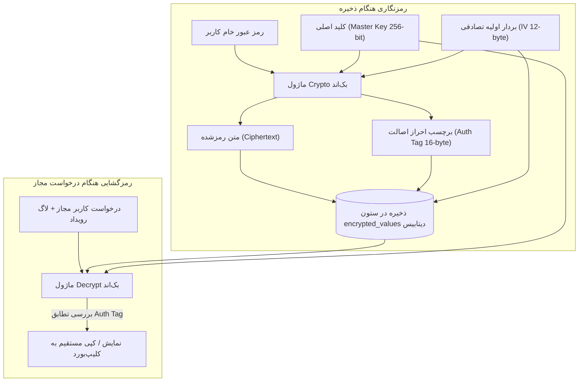

# 🔐 سند ۰۳: امنیت، رمزنگاری و کنترل دسترسی (Security & RBAC)

---

## ۱. الگوریتم و معماری رمزنگاری داده‌ها (Cryptographic Architecture)

یکی از وجوه تمایز اصلی سامانه «دفتر»، تفکیک داده‌های عمومی از داده‌های محرمانه (رمزهای عبور، توکن‌ها، گواهی‌ها، پین‌ها) و رمزنگاری داده‌های حساس در سطح ستون‌ها و فیلدها (Field-Level Encryption) است.

### ۱.۱. استاندارد رمزنگاری: AES-256-GCM
برای رمزنگاری از الگوریتم **AES-256-GCM (Galois/Counter Mode)** استفاده می‌شود. این الگوریتم از نوع **رمزنگاری معتبر (Authenticated Encryption with Associated Data - AEAD)** است که همزمان دو مزیت کلیدی دارد:
1. **محرمانگی (Confidentiality):** هیچ‌کس بدون کلید نمی‌تواند مقدار اصلی را بخواند.
2. **یکپارچگی و اصالت (Integrity & Authenticity):** به کمک برچسب اعتبارسنجی (Auth Tag)، هرگونه دستکاری یا تخریب تعمدی دیتابیس توسط کدهای مخرب فوراً شناسایی شده و مانع از رمزگشایی مقادیر مخدوش می‌گردد.



### ۱.۲. پیاده‌سازی مرجع در بک‌اند (Node.js Crypto):
```typescript
import crypto from 'node:crypto';

const ALGORITHM = 'aes-256-gcm';
const IV_LENGTH = 12; // طول بردار استاندارد برای GCM
const MASTER_KEY = Buffer.from(process.env.MASTER_ENCRYPTION_KEY!, 'hex'); // کلید ۳۲ بایتی

export interface EncryptedPayload {
  iv: string;
  authTag: string;
  ciphertext: string;
}

export function encryptSecret(plainText: string): EncryptedPayload {
  const iv = crypto.randomBytes(IV_LENGTH);
  const cipher = crypto.createCipheriv(ALGORITHM, MASTER_KEY, iv);
  
  let ciphertext = cipher.update(plainText, 'utf8', 'hex');
  ciphertext += cipher.final('hex');
  const authTag = cipher.getAuthTag().toString('hex');

  return {
    iv: iv.toString('hex'),
    authTag,
    ciphertext,
  };
}

export function decryptSecret(payload: EncryptedPayload): string {
  const decipher = crypto.createDecipheriv(
    ALGORITHM,
    MASTER_KEY,
    Buffer.from(payload.iv, 'hex')
  );
  decipher.setAuthTag(Buffer.from(payload.authTag, 'hex'));

  let decrypted = decipher.update(payload.ciphertext, 'hex', 'utf8');
  decrypted += decipher.final('utf8');
  return decrypted;
}
```

---

## ۲. ماتریس سطوح دسترسی (Role-Based Access Control - RBAC)

دسترسی کاربران به ۳ نقش اصلی و تفکیک بر اساس دسته‌بندی‌های مجاز تقسیم می‌شود:

| قابلیت / عملیات | مدیر ارشد (Super Admin) | اپراتور / مدیر فنی (Editor) | مسئول خرید و بیننده (Viewer / Procurement) |
| :--- | :---: | :---: | :---: |
| مشاهده و ویرایش ساختار فیلدها (Schema) | ✅ | ❌ | ❌ |
| مدیریت کاربران و تخصیص دسترسی | ✅ | ❌ | ❌ |
| ایجاد و ویرایش رکوردهای دارایی | ✅ | ✅ (دسته‌های مجاز) | ❌ |
| حذف دارایی‌ها | ✅ | ✅ (دسته‌های مجاز) | ❌ |
| مشاهده مشخصات عمومی (IP، نام، توضیحات) | ✅ | ✅ (دسته‌های مجاز) | ✅ (دسته‌های مجاز) |
| مشاهده و کپی رمزهای عبور (Reveal Secret) | ✅ | ✅ (با ثبت در لاگ) | ❌ (یا نیازمند مجوز صریح) |
| مشاهده و ویرایش یادآورهای سررسید | ✅ | ✅ | ✅ (دسته‌های مجاز) |
| ثبت سوابق تمدید و فاکتورها | ✅ | ✅ | ✅ |
| مشاهده تاریخچه ممیزی و لاگ‌های امنیتی | ✅ | ❌ | ❌ |
| خروجی اکسل و گزارش‌گیری | ✅ | ✅ | ✅ (بدون فیلدهای پسورد) |

---

## ۳. حفاظت از نشت رمز عبور در گزارش‌ها و لاگ‌ها (Leak Prevention)

1. **مستثنی‌سازی از سرچ سراسری:** مقادیر فیلدهای نوع `secret` تحت هیچ شرایطی ایندکس متنی نمی‌شوند و در نتایج کوئری جستجوی عمومی برگردانده نمی‌شوند.
2. **پالایش Diff در لاگ تغییرات:** زمانی که کاربری رمز عبور یک سرور را ویرایش می‌کند، در جدول `AuditLog` تنها تغییر وضعیت ثبت می‌شود:
   ```json
   // مقدار ذخیره شده در دیتابیس برای لاگ ویرایش پسورد:
   {
     "field": "root_password",
     "action": "VALUE_CHANGED",
     "note": "رمز عبور توسط کاربر ویرایش شد (مقدار ثبت نمی‌گردد)"
   }
   ```
3. **لاگ‌گیری رویدادهای بازگشایی (Read Audit):** با توجه به اینکه کپی یا نمایش پسورد یک عملیات حساس است، حتی اگر هیچ تغییری صورت نگیرد، عمل «مشاهده/کپی» در دیتابیس لاگ می‌شود:
   ```json
   {
     "userId": "usr_9981",
     "action": "READ_SECRET",
     "targetEntity": "Asset",
     "targetId": "ast_4420",
     "field": "root_password",
     "ipAddress": "192.168.1.45",
     "createdAt": "2026-09-19T16:20:00Z"
   }
   ```

---

## ۴. نیازمندی‌های مرورگر و کپی کلیپ‌بورد در شبکه داخلی (Clipboard Security & HTTPS)

طبق استاندارد وب W3C، متد `navigator.clipboard.writeText()` به دلایل امنیتی صرفاً در محیط‌های امن (**Secure Context**) فعال است:
- محیط امن شامل `https://` و یا دامنه `localhost` است.
- اگر برنامه روی `http://192.168.1.100` اجرا شود، دکمه کپی مرورگر با خطای امنیتی مسدود خواهد شد.

### راه‌حل پیاده‌سازی شده:
کانتینر وب‌سرور معکوس `Caddy` به صورت خودکار یک گواهی SSL محلی (Internal CA / Self-Signed) تولید کرده و تمام ترافیک را روی پورت `443 (HTTPS)` قرار می‌دهد. همچنین در فرانت‌اند یک مکانیزم پشتیبان (Fallback) با استفاده از `document.execCommand('copy')` تعبیه می‌شود تا در هر شرایطی فرآیند کپی بدون خطا انجام شود.
