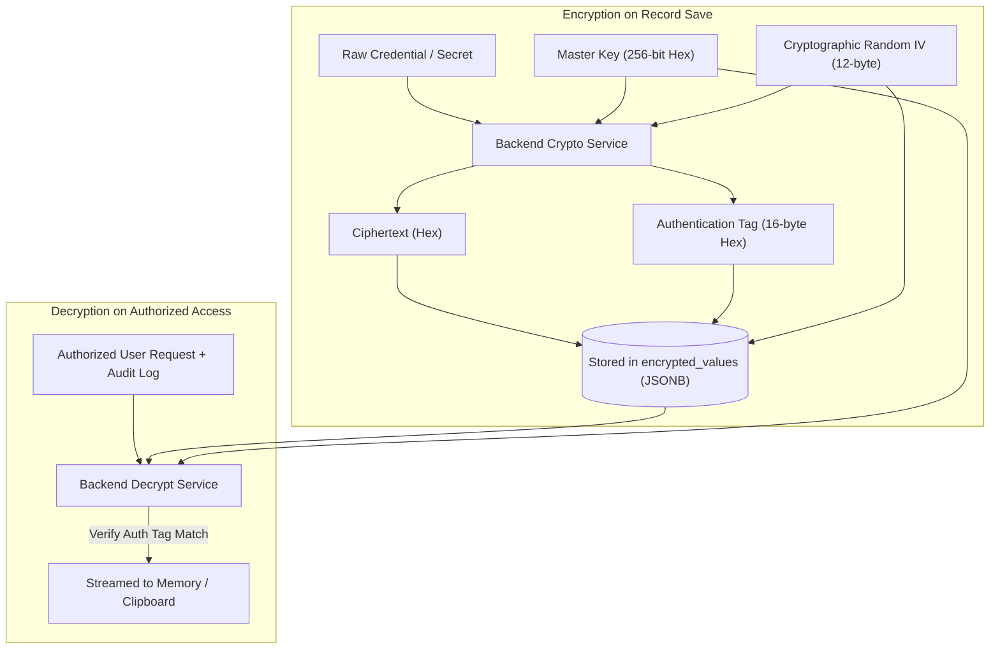

# 🔐 Document 03: Security, Cryptography & Access Control (RBAC)

---

## 1. Cryptographic Architecture

A key differentiator of **Daftar** is the strict physical and logical separation of non-sensitive metadata from sensitive enterprise secrets (passwords, private SSH keys, cloud API tokens, certificates). Sensitive data is encrypted at the field level before reaching the database.

### 1.1. Cryptographic Standard: AES-256-GCM
Daftar uses **AES-256-GCM (Galois/Counter Mode)**, an industry-standard **Authenticated Encryption with Associated Data (AEAD)** algorithm that provides two simultaneous security guarantees:
1. **Confidentiality:** The plaintext is completely unreadable without the 256-bit master key.
2. **Integrity & Authenticity:** A 16-byte authentication tag (Auth Tag) verifies that the ciphertext and initialization vector (IV) have not been tampered with. Any database corruption or intentional tampering causes decryption to fail immediately.



### 1.2. Cryptographic Implementation (Node.js Crypto):
```typescript
import crypto from 'node:crypto';

const ALGORITHM = 'aes-256-gcm';
const IV_LENGTH = 12; // Standard 96-bit IV for GCM
const MASTER_KEY = Buffer.from(process.env.MASTER_ENCRYPTION_KEY!, 'hex'); // 32-byte key

export interface EncryptedPayload {
  iv: string;
  authTag: string;
  ciphertext: string;
}

export function encryptSecret(plainText: string): EncryptedPayload {
  const iv = crypto.randomBytes(IV_LENGTH);
  const cipher = crypto.createCipheriv(ALGORITHM, MASTER_KEY, iv);
  
  let ciphertext = cipher.update(plainText, 'utf8', 'hex');
  ciphertext += cipher.final('hex');
  const authTag = cipher.getAuthTag().toString('hex');

  return {
    iv: iv.toString('hex'),
    authTag,
    ciphertext,
  };
}

export function decryptSecret(payload: EncryptedPayload): string {
  const decipher = crypto.createDecipheriv(
    ALGORITHM,
    MASTER_KEY,
    Buffer.from(payload.iv, 'hex')
  );
  decipher.setAuthTag(Buffer.from(payload.authTag, 'hex'));

  let decrypted = decipher.update(payload.ciphertext, 'hex', 'utf8');
  decrypted += decipher.final('utf8');
  return decrypted;
}
```

---

## 2. Role-Based Access Control (RBAC) Matrix

Access permissions are enforced across three user roles and further constrained by category-level permissions:

| Capability / Operation | Super Admin (`ADMIN`) | Technical Lead / Operator (`EDITOR`) | Auditor / Viewer (`VIEWER`) |
| :--- | :---: | :---: | :---: |
| Modify dynamic schema definitions | ✅ | ❌ | ❌ |
| Manage users, roles & category permissions | ✅ | ❌ | ❌ |
| Create & edit asset records | ✅ | ✅ (Assigned categories) | ❌ |
| Delete asset records | ✅ | ✅ (Assigned categories) | ❌ |
| View non-sensitive metadata (IP, Hostname, Notes) | ✅ | ✅ (Assigned categories) | ✅ (Assigned categories) |
| Reveal & copy secret credentials (Unmask) | ✅ | ✅ (Logged in audit trail) | ❌ |
| View & manage expiration alerts | ✅ | ✅ | ✅ (Assigned categories) |
| Log renewal payments & invoices | ✅ | ✅ | ✅ (Assigned categories) |
| Access security audit logs | ✅ | ❌ | ❌ |
| Export inventory reports to Excel | ✅ | ✅ | ✅ (Secrets stripped) |

---

## 3. Secret Leakage Prevention & Audit Trail

1. **Excluded from Global Search:** Attributes designated as `secret` are never indexed into PostgreSQL full-text search and are never returned in search query payloads.
2. **Sanitized Mutation Diffs:** When an asset's password is changed, the `AuditLog` entry captures only that the field changed, never storing the old or new secret:
   ```json
   {
     "field": "root_password",
     "action": "VALUE_CHANGED",
     "note": "Credential modified by user (secret value redacted)"
   }
   ```
3. **Secret Unmask & Copy Auditing:** Because viewing or copying credentials is a security-sensitive event, every reveal or clipboard copy triggers an audit entry:
   ```json
   {
     "userId": "usr_9981",
     "action": "READ_SECRET",
     "targetEntity": "Asset",
     "targetId": "ast_4420",
     "field": "root_password",
     "ipAddress": "192.168.1.45",
     "createdAt": "2026-09-22T00:15:00Z"
   }
   ```

---

## 4. Clipboard Security & HTTPS Requirements

In accordance with W3C web standards, `navigator.clipboard.writeText()` is restricted exclusively to **Secure Contexts**:
- Secure contexts include `https://` or `localhost`.
- Accessing the app over plain HTTP via an intranet IP (e.g. `http://192.168.1.100`) causes modern browsers to block clipboard operations.

### Deployment Solution:
1. The included **Caddy reverse proxy** container automatically issues an internal self-signed TLS certificate (`tls internal`) and serves traffic over `443 (HTTPS)`.
2. The frontend client includes a fallback using a legacy hidden textarea selection method, ensuring copy operations succeed even in restricted network edge cases.
