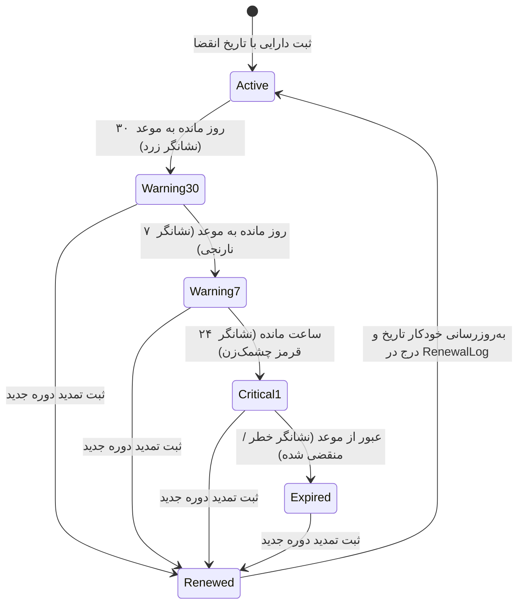

# ⚙️ سند ۰۵: مشخصات کارکردی قابلیت‌های اصلی (Core Features Spec)

---

## ۱. ماژول سازنده فیلدها و انواع دارایی (Dynamic Schema Builder)

این ماژول به مدیران سیستم اجازه می‌دهد بدون نیاز به نوشتن حتی یک خط کد یا تغییر در ساختار جداول پایگاه‌داده، انواع دارایی‌های جدید ایجاد کرده و فرم‌های ورودی را طراحی نمایند.

### ۱.۱. جریان ایجاد نوع دارایی جدید (Asset Type Creation Flow)
1. مدیر عنوان نوع دارایی (مثلاً «سوئیچ شبکه» یا «اکانت نرم‌افزار ابری»)، آیکون دلخواه و توضیحات را وارد می‌کند.
2. با استفاده از رابط بصری «افزودن فیلد»، فیلدهای مورد نیاز را یکی‌یکی اضافه می‌کند:
   - انتخاب عنوان فیلد به فارسی (مثلاً «آدرس پنل مدیریت»)
   - شناسه انگلیسی سیستمی (مثلاً `admin_url`)
   - تعیین نوع داده (متن، رمز عبور، آدرس IP، تاریخ، لیست انتخابی)
   - تعیین وضعیت اجباری بودن (`isRequired: true/false`)
   - برای فیلدهای انتخابی: درج گزینه‌ها (مثلاً `["سیسکو", "میکروتیک", "جونیپر"]`)
3. سیستم به صورت خودکار یک اسکیما با فرمت JSON تولید و در ستون `schemaDefinition` ذخیره می‌کند.

### ۱.۲. موتور اعتبارسنجی پویا (Dynamic Validation Engine)
هنگام ثبت یا ویرایش هر دارایی، بک‌اند از پکیج اعتبارسنجی (مانند `Zod` یا `Ajv`) برای ایجاد یک اعتبارسنج داینامیک بر پایه `schemaDefinition` همان دسته استفاده می‌کند:
- بررسی فیلدهای اجباری (`isRequired`).
- اعتبارسنجی ساختار IP و پورت با Regex استاندارد.
- اعتبارسنجی تاریخ‌های شمسی معتبر.

---

## ۲. ماژول مدیریت سررسیدها و یادآورهای تمدید (Renewal Reminders)

یکی از چالش‌های مکرر در شرکت‌ها، قطع ناگهانی سرویس‌ها یا سرورها به دلیل فراموشی موعد تمدید است. این ماژول فرآیند را کاملاً شفاف و هوشمند می‌سازد.



### ۲.۱. فرآیند «ثبت تمدید» (Log Renewal Workflow)
هنگامی که مسئول خرید فاکتور یا لایسنس جدید را پرداخت می‌کند، روی دکمه **«ثبت تمدید»** کلیک می‌کند. یک مودال باز می‌شود:
- تاریخ انقضای جدید (انتخاب با تقویم شمسی).
- مبلغ تمدید (به ریال/تومان) جهت گزارش‌های مالی آینده.
- شماره فاکتور یا نام شرکت ارائه‌دهنده سرویس.
- پیوست فاکتور یا سند پرداخت (تصویر یا PDF).
- سیستم تاریخ دارایی را به‌روزرسانی کرده و یک رکورد دائمی در جدول `RenewalLog` ثبت می‌کند تا تاریخچه تمام هزینه‌های پرداخت‌شده برای آن دارایی در طول زمان حفظ شود.

---

## ۳. موتور جستجوی سراسری ایمن (Secure Global Search)

- **فعال‌سازی سریع:** فشردن کلیدهای `Ctrl + K` یا `Cmd + K` از هر کجای برنامه.
- **دامنه جستجو:**
  * نام و عنوان دارایی‌ها.
  * مقادیر تمام فیلدهای متنی (آدرس‌های IP، نام کاربری، پورت‌ها، شماره سریال‌ها).
  * محتوای مستندات Markdown درون دارایی‌ها.
- **حفظ حریم امنیتی:** کوئری جستجو به هیچ وجه در مقادیر رمزهای عبور سرچ انجام نمی‌دهد؛ بنابراین امکان ندارد کاربری با سرچ کردن یک پسورد حدسی بفهمد کدام سرورها آن پسورد را دارند.
- **سرعت پاسخ:** با استفاده از ایندکس‌های Trigram و GIN در PostgreSQL، نتایج در کمتر از ۵۰ میلی‌ثانیه فیلتر و با هایلایت کردن کلمه جستجو شده نمایش داده می‌شوند.

---

## ۴. ماژول ایمپورت و اکسپورت اکسل (Excel / CSV Engine)

بسیاری از شرکت‌ها در حال حاضر فایل‌های اکسل موجود دارند. برای مهاجرت بی‌دردسر:

### ۴.۱. دریافت خروجی اکسل استاندارد (Template Export)
کاربر در هر دسته دارایی (مثلاً VPS) روی گزینه «دریافت تمپلیت اکسل» کلیک می‌کند. سیستم یک فایل `.xlsx` تولید می‌کند که سرستون‌های آن دقیقاً مطابق با فیلدهای تعریف‌شده آن دسته است (با نشان دادن ستون‌های اجباری با علامت ستاره `*`).

### ۴.۲. بارگذاری و ایمپورت دسته‌ای (Batch Import)
1. کاربر فایل اکسل پرشده را آپلود می‌کند.
2. سیستم پیش‌نمایشی از ردیف‌ها نشان می‌دهد و خطاهای احتمالی (مثل خالی بودن فیلدهای اجباری یا نامعتبر بودن فرمت IP) را مشخص می‌کند.
3. با تایید نهایی، تمام رکوردهای صحیح به صورت تراکنشی (Database Transaction) ثبت می‌شوند. فیلدهای پسورد در حین ایمپورت بلافاصله با AES رمزنگاری می‌گردند.

### ۴.۳. گزارش‌گیری اکسل (Data Export)
کاربران مجاز می‌توانند از جدول فیلترشده خروجی اکسل بگیرند. در این خروجی، ستون پسوردها برای کاربران غیرمجاز خالی یا با کاراکتر `***` جایگزین می‌شود.

---

## ۵. سیستم ردگیری و ممیزی رویدادها (Audit Trail System)

هیچ رخدادی در سیستم بدون ثبت ناپدید نمی‌شود. سیستم ممیزی دو دسته لاگ ثبت می‌کند:

### ۵.۱. لاگ تغییرات مقادیر (Mutation Diff)
هنگام ایجاد، ویرایش یا حذف یک رکورد، تغییرات فیلدها محاسبه و ثبت می‌شود:
```json
{
  "action": "UPDATE",
  "entity": "Asset",
  "entityId": "vps-tehran-01",
  "userId": "user-ali",
  "diff": {
    "ip_address": { "old": "192.168.1.10", "new": "192.168.1.50" },
    "ssh_port": { "old": "22", "new": "2222" }
  },
  "timestamp": "2026-09-19T18:30:00Z"
}
```

### ۵.۲. لاگ امنیتی دسترسی به اسرار (Secret Access Log)
هر بار که کاربری روی دکمه چشم (نمایش رمز) یا کپی کلیک می‌کند:
- شناسه کاربر، نام فیلد، آدرس IP و شناسه دارایی ثبت می‌شود.
- مدیر ارشد در صفحه «گزارش لاگ‌ها» می‌تواند ببیند چه کسانی در طول روز کدام پسوردها را کپی کرده‌اند.
