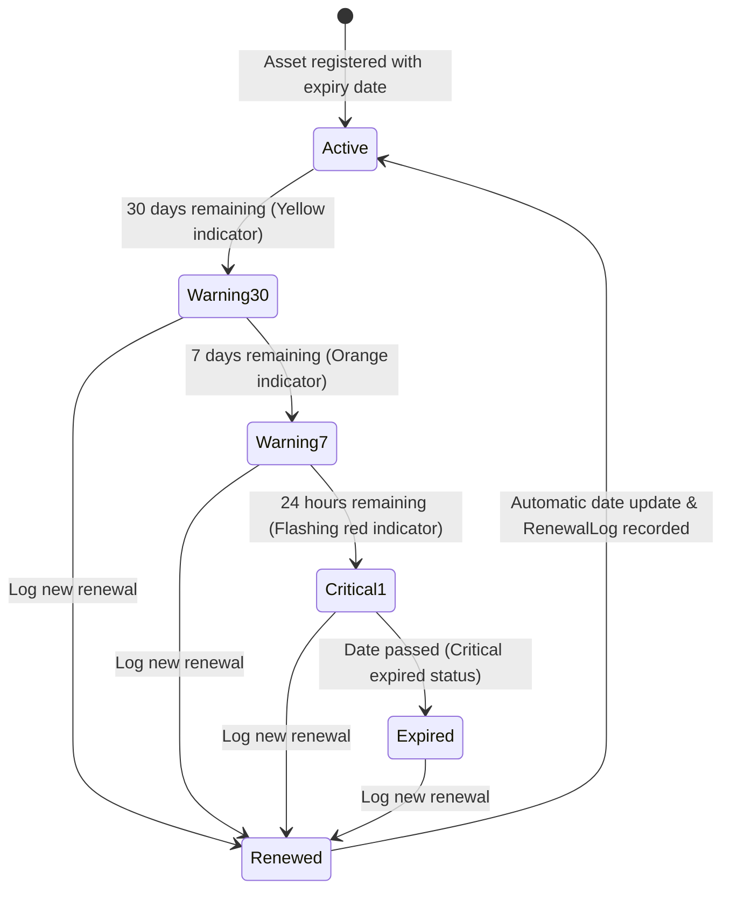

# ⚙️ Document 05: Core Features Specification

---

## 1. Dynamic Schema Builder

The Dynamic Schema Builder empowers administrators to create new asset categories and configure customized data fields on the fly without writing code or modifying database tables.

### 1.1. Category Creation Flow
1. An administrator inputs the category name (e.g. "Network Switches", "Cloud Subscriptions"), selects a Lucide icon, and adds an optional description.
2. Using the visual field builder, attributes are added incrementally:
   - Field display label (e.g. "Management Console URL")
   - System key identifier (e.g. `admin_url`)
   - Data type (`text`, `secret`, `ip_port`, `jalali_date`, `select`, `email`, `textarea`, `url`)
   - Mandatory validation requirement (`isRequired: true/false`)
   - Predefined dropdown options (for `select` types)
3. The platform generates a validated JSON schema and stores it in `schemaDefinition`.

### 1.2. Dynamic Validation Engine
On every asset creation or update, the backend creates an on-the-fly validator adhering to the category's `schemaDefinition`:
- Mandatory field enforcement.
- IP address and port format validation.
- Valid Jalali/Gregorian date formatting.

---

## 2. Renewal Reminders & Automated Notification Worker

Unplanned downtime caused by expired domains, certificates, or cloud instances is prevented through automated multi-stage alerts.



### 2.1. Multi-Channel Notification Worker
A background worker continuously monitors upcoming expirations and triggers notifications via:
- **Telegram Bot Webhooks**
- **Bale Messenger Webhooks**
- **Discord Webhooks**
- **Custom JSON Webhooks**
- **Email / SMS Gateways**

Thresholds trigger automated messages at **30 days, 7 days, 24 hours, and day-of expiration**, complemented by automated weekly digest summaries.

### 2.2. Renewal Logging Workflow
When a subscription or asset is renewed:
1. The user clicks **"Log Renewal"**.
2. A modal prompts for:
   - New expiration date
   - Renewal cost in organizational currency
   - Vendor invoice number and notes
   - Attached proof of payment or receipt
3. The asset's `expiryDate` updates, and an immutable entry is added to `RenewalLog`.

---

## 3. Secure Global Search

- **Instant Trigger:** Pressing `Ctrl + K` or `Cmd + K` opens the search palette from any page.
- **Search Scope:**
  * Asset titles and identifiers
  * Text fields (IP addresses, hostnames, usernames, serial numbers)
  * Markdown documentation and runbooks
- **Zero-Knowledge Privacy:** Secrets and passwords are explicitly excluded from full-text indexes.
- **Sub-50ms Response:** Powered by PostgreSQL Trigram and GIN indexes, results return instantly with keyword highlighting.

---

## 4. Excel & CSV Data Pipeline

### 4.1. Template Export
Administrators can download customized `.xlsx` templates preconfigured with the exact column headers matching an asset category, with required columns marked with an asterisk (`*`).

### 4.2. Batch Import
1. Users upload populated Excel spreadsheets.
2. The system previews rows, highlighting formatting issues and missing mandatory fields.
3. Upon approval, records are committed in a single database transaction. Secret fields are encrypted on the fly with AES-256-GCM.

### 4.3. Filtered Export
Authorized users can export the current grid view into an `.xlsx` workbook. Passwords and secret tokens are automatically redacted unless the user holds elevated permissions.

---

## 5. Comprehensive Audit Trail

Every state change and security event is permanently recorded:

### 5.1. Mutation Diffs
Record creations, updates, and deletions capture precise before-and-after attribute values:
```json
{
  "action": "UPDATE",
  "entity": "Asset",
  "entityId": "vps-tehran-01",
  "userId": "user-ali",
  "diff": {
    "ip_address": { "old": "192.168.1.10", "new": "192.168.1.50" },
    "ssh_port": { "old": "22", "new": "2222" }
  },
  "timestamp": "2026-09-22T00:15:00Z"
}
```

### 5.2. Secret Access Audit
Whenever a credential is revealed or copied:
- The user ID, timestamp, client IP, and target field are logged.
- Administrators can audit credential usage patterns directly in the Audit Trail dashboard.
